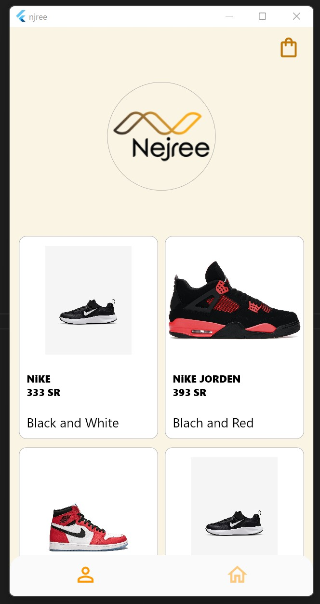
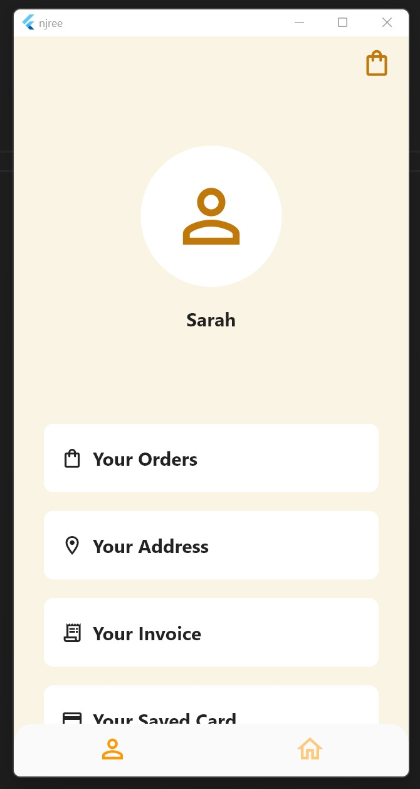

# Njree Application
This program was written as requested by instructor **_Fahad Alazmi - Tuwaiq Academy_**,
using Flutter.

##### A Shopping Application that allows the customer to view items in the shop and jump between pages, works on iOS, Android and Web
 
## Requirements : 
-	Column 
-	ListView
-	Shape
-	Container 
-	Navigator
-	Image
-	Botton
-	BottomNavigationBar

## What I Learned

I learned new valuable things from this project
_**ViewPage()**_ to reach the next pages smoothly by animating it using the _**pageController**_
And _**Curves**_.

Learned that _**extendBody**_ under _**Scaffold**_ solve the problem of unwanted background when you trying to round navigation bar edges

How to disable labels from the navigation bar 

How to disable the tooltip when you hover over items 

 ___________________________
 ## Screenshots

#### The final product is an exact copy of the requested design, enhanced version will be coming soon!  
$~~~~~~~~~~~~~~~~~~~$
`Home Screen` 
$~~~~~~~~~~~~~~~~~~~~~~~~~~~~~~~~~~~$
 `Profile Screen`
$~~~~~~~~~~~~~~~~~~~~~~~~~~~~~~~~~$
`Cart Screen`  

 

###### Programmed by _Sarah_
